

  

  <a href="#projetos">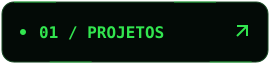</a>
  
  
  

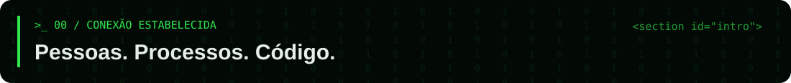


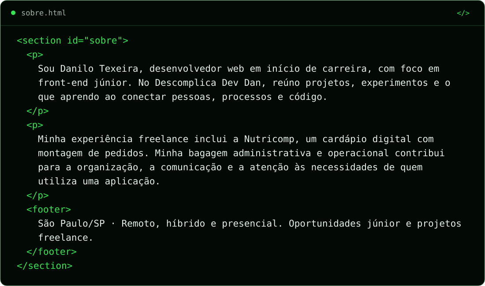

Sobre mim · versão em texto

Sou **Danilo Texeira**, desenvolvedor web em início de carreira, com foco em **front-end júnior**. No Descomplica Dev Dan, reúno projetos, experimentos e o que aprendo ao conectar pessoas, processos e código.

Minha experiência freelance inclui a **Nutricomp**, um cardápio digital com montagem de pedidos. Minha bagagem administrativa e operacional contribui para a organização, a comunicação e a atenção às necessidades de quem utiliza uma aplicação.

**São Paulo/SP · Remoto, híbrido e presencial · Oportunidades júnior e projetos freelance**

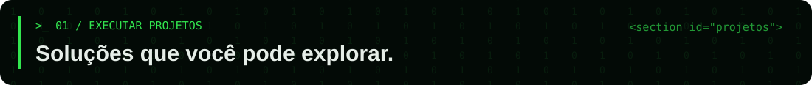

<a href="https://www.nutricomp.com.br/">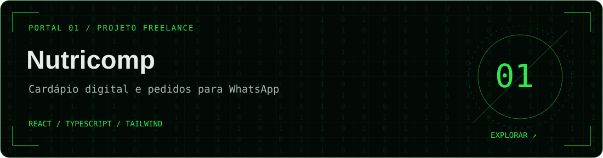</a>

**Cardápio digital e preparação de pedidos para WhatsApp.** Projeto freelance de front-end, realizado entre março e julho de 2026.

Combos personalizados, gramagem obrigatória, preços por tamanho e carrinho persistente. O checkout prepara uma mensagem com os itens e dados de entrega para o cliente enviar pelo WhatsApp.

 

<strong>>_ inspecionar nutricomp · Regras e decisões técnicas</strong>

- **Escolha dos produtos:** filtros por categoria, busca por produtos e ingredientes e consulta nutricional.
- **Montagem do pedido:** controle da quantidade de itens nos combos e seleção obrigatória de gramagem.
- **Estado e persistência:** Context API e LocalStorage, com itens separados por gramagem.
- **Atendimento:** mensagem organizada em combos, itens avulsos, entrega e preferência de pagamento.
- **Interface:** React, TypeScript e Tailwind CSS; checkout e montador de combos carregados sob demanda.

A entrega reúne seleção, regras comerciais e preparação do pedido. O envio e a continuidade do atendimento acontecem no WhatsApp; não há alegação de integração com sua API ou de processamento de pagamentos.

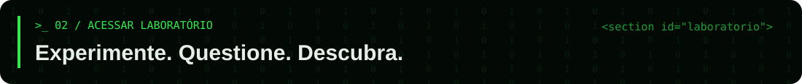
<a href="https://motor-busca.vercel.app/">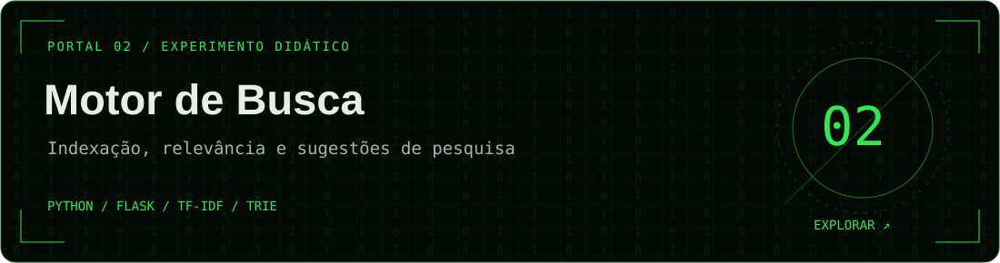</a>

**Como encontrar informação e ordenar resultados?** Um projeto didático para explorar indexação, recuperação de documentos e relevância.

Python e Flask conectam um índice invertido, ranqueamento com TF-IDF e sugestões por prefixo com Trie. A interface apresenta trechos dos documentos e pontuação dos resultados.

 

<strong>>_ iniciar missão · Teste o motor de busca</strong>

1. Abra a demonstração e pesquise **busca**.
2. Observe o trecho encontrado e sua pontuação de relevância.
3. Pesquise **raposa busca** e compare as opções **qualquer termo** e **todos os termos**.
4. Explore o código para entender como os documentos são indexados.

Os resultados dependem do conjunto de documentos disponível na aplicação.

<strong>>_ inspecionar busca · Algoritmos, API e testes</strong>

- **Índice invertido:** associa termos aos documentos em que aparecem.
- **TF-IDF:** atribui pesos aos termos para ordenar resultados por relevância.
- **Trie:** permite sugestões a partir de prefixos.
- **JSON:** persiste o índice; o projeto o recria quando ausente, desatualizado ou inválido.
- **API REST:** disponibiliza consultas programáticas com respostas em JSON.
- **unittest:** verifica persistência e carregamento do índice.
- **Vercel:** hospeda a demonstração pública.

### Outros experimentos

Também pratico rotinas de atendimento e suporte em um **simulador de chamados**. Essa atividade pertence ao meu aprendizado em projetos.

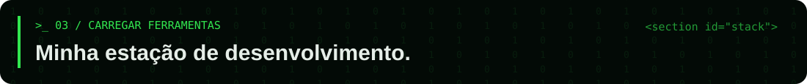

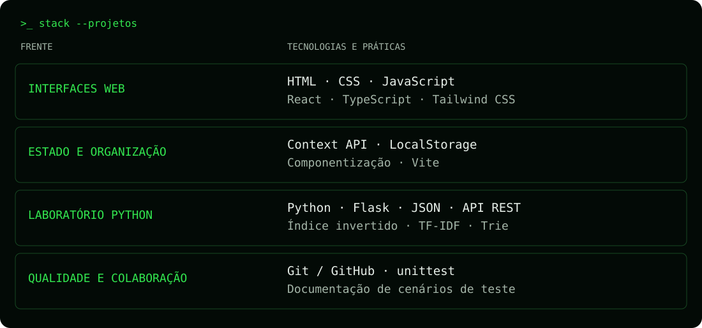

<strong>&gt;_ stack --texto · Consultar tecnologias em texto</strong>

| Frente | Prática |
| :--- | :--- |
| **Interfaces web** | HTML, CSS, JavaScript, React, TypeScript e Tailwind CSS |
| **Estado e organização** | Context API, LocalStorage, componentização e Vite |
| **Laboratório de programação** | Python, Flask, JSON, API REST e estruturas de dados |
| **Qualidade e colaboração** | Git/GitHub, unittest e documentação de cenários de teste |

Tecnologias utilizadas em projetos. **Testes funcionais também fazem parte da minha experiência de trabalho.**

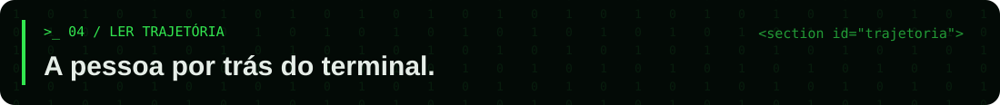

<strong>>_ trajetória --expandir · Pessoas, processos e desenvolvimento</strong>

- **Formação:** Bacharelado em Sistemas de Informação pela Faculdade Descomplica, concluído em 2026.
- **Desenvolvimento web autônomo:** desde agosto de 2026, sob a marca Descomplica Dev Dan.
- **Nutricomp:** experiência freelance em front-end, de março a julho de 2026.
- **Instituto Pilar:** Assistente de Campo desde dezembro de 2025, com atendimento, documentação e mediação de conflitos.
- **Marinha do Brasil:** trajetória administrativa e operacional de 2016 a 2025.

Levo dessa experiência a organização de rotinas, a comunicação entre pessoas e a responsabilidade com registros. Minha carreira em desenvolvimento está no início; a bagagem operacional faz parte do que trago para a equipe.

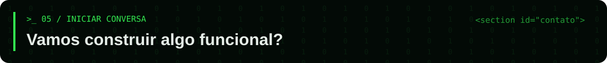

Procuro oportunidades de **front-end júnior** e considero projetos freelance com escopo definido.

 

Consultar endereço em texto

`descomplicadevdan@gmail.com`

<strong>>_ novo projeto · Abra o briefing da conversa</strong>

Conte qual problema deseja resolver, quem vai usar a solução e quais entregas são necessárias. Se houver prazo ou referências, inclua essas informações na conversa.

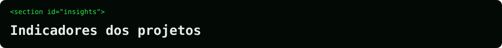

<a href="https://github.com/DescomplicaDevDan?tab=repositories">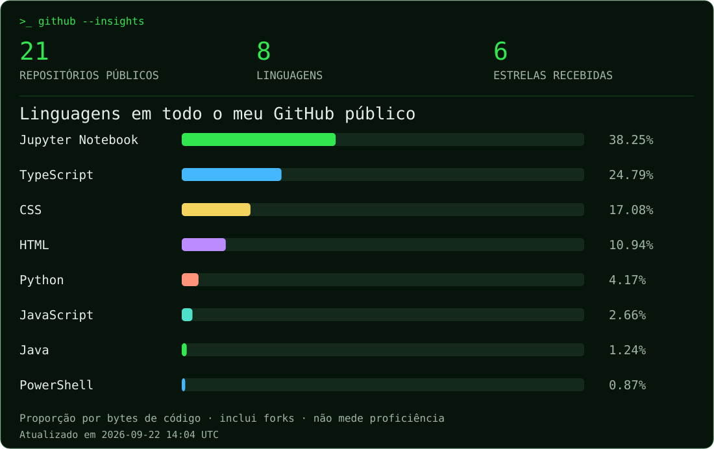</a>

Os códigos que fazem parte da minha jornada, reunidos em um panorama atualizado diariamente.

<strong>&gt;_ insights --linguagens · Ver números e linguagens em texto</strong>

<!-- insights:start -->
Atualizado em **2026-09-17 13:14 UTC**. **21 repositórios públicos**, **8 linguagens** e **6 estrelas recebidas**. Forks incluídos: **2**.

| Linguagem | Proporção do código |
| :--- | ---: |
| Jupyter Notebook | 38.88% |
| TypeScript | 24.28% |
| CSS | 17.35% |
| HTML | 11.12% |
| Python | 3.53% |
| JavaScript | 2.71% |
| Java | 1.26% |
| PowerShell | 0.88% |
<!-- insights:end -->

<strong>&gt;_ insights --fontes · Como estes dados são calculados</strong>

- **Abrangência:** todos os repositórios públicos da conta DescomplicaDevDan, incluindo forks e arquivados. Repositórios privados e contribuições em contas de terceiros não entram neste painel.
- **Linguagens:** soma dos bytes de cada linguagem detectada pelo GitHub nos repositórios. Os percentuais representam volume de código, não tempo de estudo, quantidade de commits ou proficiência.
- **Estrelas:** soma das estrelas recebidas pelos repositórios públicos da conta.
- **Atualização:** diária pelo GitHub Actions. A data no painel indica a última coleta concluída; se uma consulta falhar, os últimos dados válidos são preservados.

[Consultar dados por repositório](./github-insights.json) · [Acompanhar atualização](https://github.com/DescomplicaDevDan/DescomplicaDevDan/actions/workflows/insights.yml) · [Documentação da fonte](https://docs.github.com/en/rest/repos/repos#list-repository-languages)

